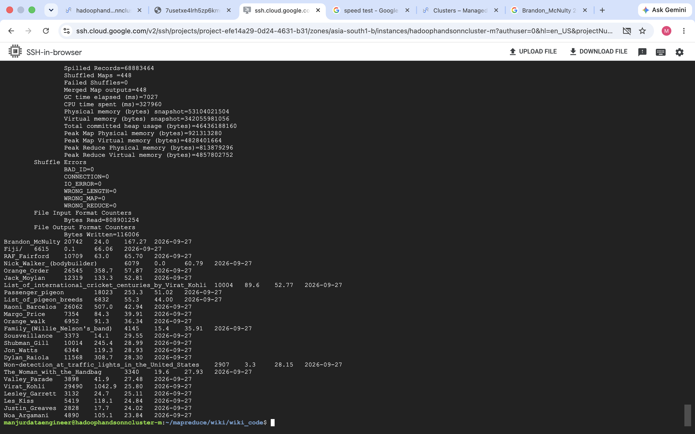
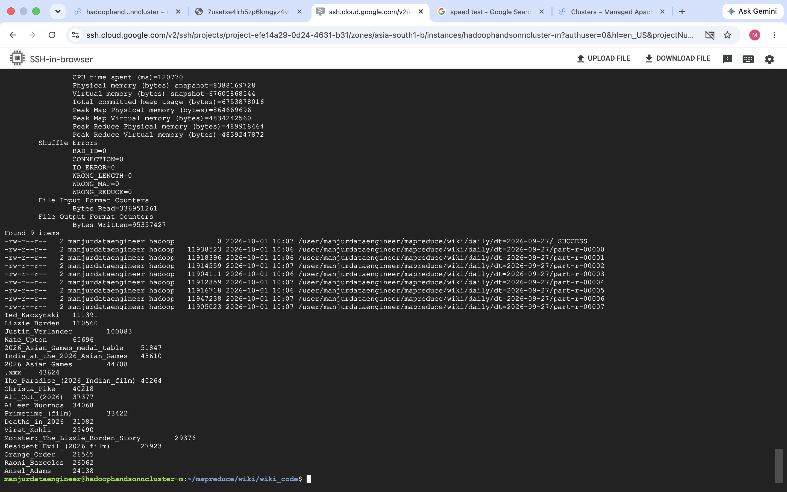
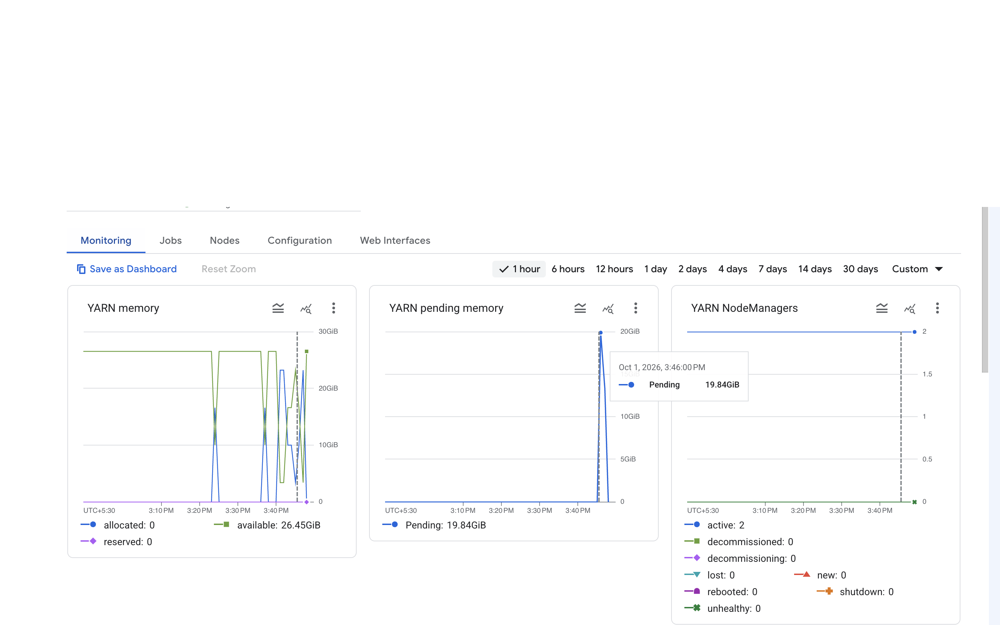

# Wikipedia Trending Articles with Hadoop MapReduce

This project uses two Java MapReduce jobs to find English Wikipedia articles whose page views rise sharply on a selected day. Wikimedia hourly pageview dumps are stored in HDFS, aggregated into daily article totals, then compared with the previous seven days. The Hadoop cluster used for the recorded run was hosted on Google Cloud; the jobs themselves use Hadoop APIs and do not provision GCP resources.

## How It Works

1. `dataset_download_script/ingest_day.sh` downloads the 24 hourly Wikimedia pageview files for a date and writes them to an HDFS date partition.
2. `java_code/DailyViews.java` reads those compressed files, keeps the `en` and `en.m` domains, excludes the main page and selected namespace prefixes, and sums views by article title. Its default reducer count is 8.
3. `java_code/Trending.java` reads the daily totals for the target date and its history window. It keeps articles with at least 5,000 target-day views and calculates a smoothed traffic ratio:

   `ratio = target_day_views / (seven_day_average + 100)`

The ratio is a ranking signal, not a statistical significance test. `Trending` writes all articles that pass the view threshold; use a sort command to select the top results.

## Repository Layout

```text
java_code/
  DailyViews.java                 Daily aggregation MapReduce job
  Trending.java                   Target-day versus history MapReduce job
dataset_download_script/
  ingest_day.sh                   Downloads one day of hourly dumps to HDFS
small_sample_file/
  sample_pageviews.txt             Small input for testing DailyViews
Output/
  final_output.png                 Example final trending output
  output_per_day_top20_views.png   Example daily top-20 output
  memory_usages.png                Cluster memory monitoring screenshot
command.bat                        Original command notes from the cluster run
```

## Requirements

- A working Hadoop installation and access to HDFS, such as a running GCP Hadoop cluster.
- Java 9 or later for compiling the source (`Set.of` is used); use a Java version supported by the cluster's Hadoop distribution.
- `javac`, `jar`, `hadoop`, `curl`, and `bash` on the machine where the commands run.
- HDFS space for the hourly compressed dumps and MapReduce output. A full eight-day window downloads 192 hourly files.

## Build

Run from this project directory on a machine configured with the cluster's Hadoop client:

```bash
mkdir -p build/classes
javac -cp "$(hadoop classpath)" -d build/classes \
  java_code/DailyViews.java java_code/Trending.java
jar -cf build/wiki.jar -C build/classes .
```

## Try the Daily Aggregation Job

The bundled sample includes desktop and mobile records. The job combines both records by title, skips `Main_Page` and non-English domains, and should produce totals such as `Goku 1700` and `Vegeta 1000`.

```bash
HDFS_ROOT=/user/your_hdfs_user/wiki
hadoop fs -mkdir -p "$HDFS_ROOT/sample-input"
hadoop fs -put -f small_sample_file/sample_pageviews.txt "$HDFS_ROOT/sample-input/"
hadoop jar build/wiki.jar DailyViews \
  "$HDFS_ROOT/sample-input" "$HDFS_ROOT/sample-daily" 1
hadoop fs -cat "$HDFS_ROOT/sample-daily/part-r-00000"
```

Hadoop requires the output directory not to exist before a job starts. Remove an old output path explicitly before rerunning a job, for example:

```bash
hadoop fs -rm -r "$HDFS_ROOT/sample-daily"
```

## Run the Eight-Day Pipeline

Choose a target date and ensure the HDFS root is consistent in every command. **Before running the downloader, edit `dataset_download_script/ingest_day.sh`: it currently hardcodes `/user/mayank0953/wiki`, while `command.bat` uses `/user/manjurdataengineer/wiki`.** Replace that path with the HDFS root you use below. The script expects a date in `YYYY-MM-DD` format and downloads all 24 hourly files for that day.

The following example uses `2026-09-27`, with the preceding seven days as history. Run on a Bash/Linux cluster client with enough HDFS capacity:

```bash
HDFS_ROOT=/user/your_hdfs_user/wiki
TARGET_DAY=2026-09-27

# Download the target day and the seven preceding days.
for offset in {7..0}; do
  day=$(date -d "$TARGET_DAY - $offset day" +%F)
  ./dataset_download_script/ingest_day.sh "$day"
done

# Aggregate each day and collect the eight input partitions for Trending.
HISTORY_PATHS=
for offset in {7..0}; do
  day=$(date -d "$TARGET_DAY - $offset day" +%F)
  hadoop jar build/wiki.jar DailyViews \
    "$HDFS_ROOT/raw/dt=$day" "$HDFS_ROOT/daily/dt=$day" 8
  HISTORY_PATHS="${HISTORY_PATHS:+$HISTORY_PATHS,}$HDFS_ROOT/daily/dt=$day"
done

# Compare target-day totals with the seven preceding daily totals.
hadoop jar build/wiki.jar Trending "$TARGET_DAY" \
  "$HISTORY_PATHS" "$HDFS_ROOT/trending/dt=$TARGET_DAY"
```

Sort by the fourth output field (the ratio) to inspect the top 25:

```bash
hadoop fs -cat "$HDFS_ROOT/trending/dt=$TARGET_DAY/part-r-*" \
  | sort -t $'\t' -k4,4nr | head -25
```

## Output Format

The daily job writes Hadoop text output as:

```text
article_title<TAB>daily_views
```

The trending job writes:

```text
article_title<TAB>target_day_views<TAB>seven_day_average<TAB>ratio<TAB>target_date
```

The average is formatted to one decimal place, the ratio to two decimal places, and articles below 5,000 target-day views are omitted. The target date and seven-day history length are currently passed/configured in the Java code; the minimum view threshold and history length default to 5,000 and 7 respectively.

## Example Results

Screenshots below are from the recorded Hadoop run for `2026-09-27`.
The project screenshots and other visual output files are kept in `Output/`.







## Notes and Limitations

- The project contains the Java jobs, downloader, sample input, command notes, and screenshots. The full Wikimedia dump files are not included; the downloader fetches them directly from Wikimedia.
- `command.bat` is a set of shell command notes, not a Windows batch script. Its HDFS username and some paths are specific to the original cluster session.
- The downloader streams each hourly file through `curl` into HDFS and retries failed downloads, but it does not validate that all 24 hourly files were received. Check the HDFS partition before starting the MapReduce job.
- Article titles are grouped as they appear in the pageview dump; this is not a canonicalization step, and page titles that differ by domain only are aggregated together.
- The trending output is ranked by the ratio only after the job completes; the job itself does not limit results to a top-N list.